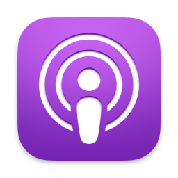

# Alfred Podcasts Workflow

A personal project for managing podcasts in Alfred.

## Features

### Subscriptions

The workflow fetches Podcast feeds from a URL, in OPML format.

I export my podcast subscriptions and push them to a GitHub repository to keep them in sync.
You need to provide an API token, if the repository is private.

You can unsubscribe a podcast, or add a new subscription by providing the RSS feed URL.
The workflow will push the updated OPML file to your repository.

### Media Player Integration

I use [IINA](https://github.com/iina/iina) to play podcasts, which supports IPC control via a socket.

The workflow can play podcasts in IINA, and keep track of the playlist.

### Usage

- `pc` to list all podcasts
- `pcl` to list the latest episodes
- `pcn` to list now playing episodes
- `pca` to add a podcast

## Installation

Run `make` to compile.
